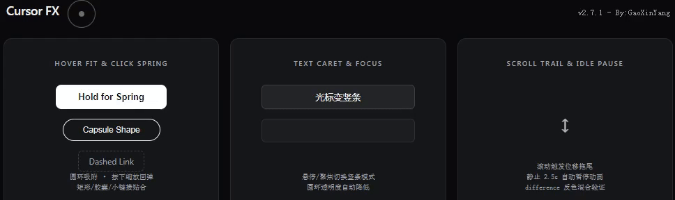

<h1 align="center">   Cursor FX</h1>

<p align="center">
  <strong>Smooth custom cursor with spring physics — a single userscript, zero dependencies.</strong>
</p>

<p align="center">
  <a href="https://github.com/Xinyang-Gao/cursor-fx-userscript/releases"></a>
  <a href="https://github.com/Xinyang-Gao/cursor-fx-userscript/blob/main/LICENSE"></a>
  <a href="https://www.tampermonkey.net/"></a>
  <a href="https://violentmonkey.github.io/"></a>
</p>

<p align="center">
  <a href="#english">English</a> · <a href="#中文">中文</a>
</p>

---

<a id="english"></a>

## Features

| Feature | Description |
|---|---|
| **Dot + Ring cursor** | Replaces the system pointer with a small dot and a trailing ring. |
| **Delayed ring follow** | The ring chases the dot with frame-rate-independent exponential smoothing. |
| **Hover fitting** | Hovering over links, buttons, or any interactive element morphs the ring to wrap the target, respecting its `border-radius`. |
| **Text caret mode** | Over `<input>`, `<textarea>`, `[contenteditable]`, etc., the dot becomes a thin vertical bar and the ring dims. |
| **Click spring scale** | Pressing triggers a spring-physics shrink; releasing bounces back with configurable stiffness & damping. |
| **Scroll trail** | Scrolling offsets the cursor briefly, then it decays back — a subtle motion cue. |
| **Idle auto-pause** | The `requestAnimationFrame` loop stops after a configurable idle period, resuming instantly on input. |
| **GPU-composited** | All positioning uses `transform: translate3d(…)` + `will-change`, staying on the compositor thread. |
| **`prefers-reduced-motion`** | Automatically flattens animations when the OS requests reduced motion. |
| **Settings panel** | Open via the Tampermonkey / Violentmonkey menu → **⚙ Cursor FX Settings**. Every slider updates in real time and auto-saves. |
| **Bilingual UI** | Settings panel supports **简体中文** and **English**, auto-detected from `navigator.languages`. |
| **Web API** | Page scripts can query state or change settings through `CustomEvent` (see [API](#-web-api)). |
| **Touch-safe** | Skips entirely on `pointer: coarse` devices. |
| **Shadow DOM isolation** | The settings panel lives inside a Shadow Root — no style leaks, no conflicts. |

## Preview

<!-- Replace with your own GIF / screenshot -->
<!-- <p align="center"></p> -->

> *TODO: add a short demo GIF here.*

## Installation

### Prerequisites

Install a userscript manager:

- [Tampermonkey](https://www.tampermonkey.net/) (Chrome / Firefox / Edge / Safari / Opera)
- [Violentmonkey](https://violentmonkey.github.io/) (Chrome / Firefox / Edge)

### Install the script

Click the badge below, then confirm the installation in the extension popup:

<a href="https://raw.githubusercontent.com/Xinyang-Gao/cursor-fx-userscript/main/cursor-fx-userscript.user.js">
  
</a>

Or manually: open the userscript manager dashboard → **Create a new script** → paste the contents of [`cursor-fx-userscript.user.js`](cursor-fx-userscript.user.js) → save.

## Usage

Once installed, the script runs automatically on **every page** (`@match *://*/*`).

- Move the mouse — the dot follows instantly; the ring trails behind.
- Hover a button or link — the ring expands and wraps the element.
- Click — both dot and ring spring-shrink, then bounce back.
- Scroll — a short directional trail appears.
- Type in a text field — the dot becomes a caret bar.

### Open the settings panel

1. Click the **Tampermonkey / Violentmonkey** toolbar icon.
2. Select **⚙ Cursor FX Settings**.
3. Adjust sliders — changes apply **instantly** and are **auto-saved**.
4. Press **Esc** or click outside the panel to close it.

## Settings Reference

The following boolean toggles control core features (all default to **ON**):

| Key | Default | Description |
|---|---|---|
| `ENABLE_DOT` | ON | Show / hide the dot |
| `ENABLE_RING` | ON | Show / hide the ring |
| `HIDE_CURSOR` | ON | Hide the system cursor |
| `SCROLL_ENABLED` | ON | Enable scroll trail feedback |

The remaining numeric parameters are grouped below:

| Group | Key | Default | Range | Description |
|---|---|---|---|---|
| Appearance | `DOT_SIZE` | 8 px | 2 – 24 | Dot diameter |
| Appearance | `RING_SIZE` | 40 px | 16 – 96 | Ring diameter (idle) |
| Appearance | `RING_BORDER` | 1.5 px | 0.5 – 6 | Ring stroke width |
| Appearance | `RING_ALPHA` | 0.9 | 0.1 – 1 | Ring opacity |
| Fitting | `FIT_PADDING` | 6 px | 0 – 24 | Extra padding when wrapping an element |
| Fitting | `MAX_FIT_SIZE` | 200 px | 80 – 480 | Skip fitting for elements larger than this |
| Following | `FOLLOW_SPEED` | 16 | 2 – 40 | Ring chase speed (higher = snappier) |
| Following | `FIT_SPEED` | 26 | 4 – 80 | Speed when morphing onto a target |
| Following | `SHAPE_SPEED` | 18 | 4 – 80 | Size / border-radius interpolation speed |
| Click | `CLICK_SCALE` | 0.78 | 0.4 – 1 | Scale factor while pressed |
| Click | `SPRING_K` | 520 | 100 – 1200 | Spring stiffness |
| Click | `SPRING_DAMP` | 21 | 5 – 40 | Spring damping |
| Scroll | `SCROLL_MAX` | 30 px | 0 – 80 | Max trail offset |
| Scroll | `SCROLL_DECAY` | 7 | 1 – 20 | How fast the trail retracts |
| Text | `TEXT_BAR_W` | 2 px | 1 – 6 | Caret bar width |
| Text | `TEXT_BAR_H` | 22 px | 12 – 40 | Caret bar height |
| Text | `TEXT_RING_SIZE` | 24 px | 12 – 64 | Ring size in text mode |
| Text | `TEXT_RING_ALPHA` | 0.4 | 0.1 – 1 | Ring opacity in text mode |
| Other | `IDLE_PAUSE_MS` | 2500 ms | 500 – 10000 | Idle time before the RAF loop pauses |

> When the OS **Reduce Motion** setting is on, speed / spring / scroll fields are overridden and disabled in the panel automatically.

## Web API

Page scripts can communicate with Cursor FX via `CustomEvent`:

```js
// Helper
function cursorFX(action, payload) {
  return new Promise(resolve => {
    const requestId = crypto.randomUUID();
    const handler = e => {
      if (e.detail.requestId !== requestId) return;
      window.removeEventListener('CURSORFX_RESPONSE', handler);
      resolve(e.detail.result);
    };
    window.addEventListener('CURSORFX_RESPONSE', handler);
    window.dispatchEvent(new CustomEvent('CURSORFX_REQUEST', {
      detail: { action, requestId, payload }
    }));
  });
}

// Wait for ready
window.addEventListener('CURSORFX_READY', async () => {
  console.log(await cursorFX('getStatus'));
  await cursorFX('setSetting', { key: 'RING_SIZE', value: 56 });
});
```

| Action | Payload | Response |
|---|---|---|
| `ping` | — | `{ status, version }` |
| `getVersion` | — | `{ version, scriptVersion }` |
| `getStatus` | — | `{ visible, pressed, hoverEl, focusEl, textMode, ringDim, scrollOffset, dotScale, ringScale }` |
| `getSettings` | — | `{ settings: { … } }` |
| `setSetting` | `{ key, value }` | `{ success, key, value }` |
| `resetSettings` | — | `{ success }` |
| `toggleVisible` | — | `{ visible }` |

## Technical Notes

- **Positioning** — `transform: translate3d()` on `position: fixed` elements; no layout / paint triggered per frame.
- **Smoothing** — `1 − e^(−speed · dt)` exponential approach, frame-rate independent.
- **Spring** — Semi-implicit Euler integration: `v += (target − x) · k · dt; v *= e^(−damp · dt); x += v · dt`.
- **Hit-testing** — `mouseover` + `Element.closest()` with `isConnected` guard; no per-frame `elementFromPoint`.
- **`mix-blend-mode: difference`** — The cursor stays visible on any background.
- **`@noframes`** — Avoids duplicate cursors inside `<iframe>`s.
- **`@run-at document-start`** — Injects the `cursor: none !important` stylesheet before first paint, preventing a flash of the native cursor.

## Browser Support

| Browser | Status |
|---|---|
| Chrome / Edge ≥ 88 | ✅ |
| Firefox ≥ 85 | ✅ |
| Safari ≥ 15 (with Tampermonkey) | ✅ |
| Opera ≥ 74 | ✅ |
| Touch-only devices | ⏭ Skipped automatically |

## Project Structure

```
cursor-fx-userscript/
├── cursor-fx-userscript.user.js   # The userscript (single file, no build step)
├── cursor-fx-userscript.meta.js   # Metadata block for auto-update
├── LICENSE                        # MIT
├── README.md                      # This file
└── assets/                        # Screenshots / GIFs
```

## Contributing

1. Fork the repo and create a feature branch.
2. Keep everything in the **single `.user.js` file** — no build tools.
3. Follow the existing code style (4-space indent, `'use strict'`).
4. Test on at least Chrome + Firefox.
5. Open a Pull Request with a clear description.

Bug reports and feature requests are welcome via [Issues](https://github.com/Xinyang-Gao/cursor-fx-userscript/issues).

## License

[MIT](LICENSE) © [Xinyang-Gao](https://github.com/Xinyang-Gao)

---

<a id="中文"></a>

## 功能特性

| 特性 | 说明 |
|---|---|
| **圆点 + 圆环光标** | 隐藏系统指针，以小圆点 + 延迟跟随圆环替代。 |
| **延迟跟随** | 圆环以帧率无关的指数平滑追踪圆点。 |
| **悬停贴合** | 悬停链接、按钮等交互元素时，圆环变形包裹目标，自动适配 `border-radius`。 |
| **文本竖条模式** | 在 `<input>`、`<textarea>`、`[contenteditable]` 等文本区域，圆点变为竖条，圆环降低透明度。 |
| **点击弹性缩放** | 按下时弹簧物理收缩，松开后回弹，刚度 / 阻尼可调。 |
| **滚动拖尾** | 滚动时光标产生短暂方向偏移，随后衰减归位。 |
| **空闲自动暂停** | 超过设定空闲时间后停止 `requestAnimationFrame` 循环，输入即恢复。 |
| **GPU 合成层** | 全部定位使用 `transform: translate3d(…)` + `will-change`，不触发重排重绘。 |
| **减少动态效果** | 检测 `prefers-reduced-motion`，自动弱化所有动画。 |
| **设置面板** | 通过篡改猴 / Violentmonkey 菜单 → **⚙ 光标设置** 打开，滑块实时生效、自动保存。 |
| **双语界面** | 设置面板支持 **简体中文** 和 **English**，根据 `navigator.languages` 自动选择。 |
| **Web API** | 页面脚本可通过 `CustomEvent` 查询状态或修改设置（见 [API](#-web-api-1)）。 |
| **触屏安全** | 在 `pointer: coarse` 设备上自动跳过，不注入任何内容。 |
| **Shadow DOM 隔离** | 设置面板置于 Shadow Root 内，样式零泄漏、零冲突。 |

## 预览

<!-- 替换为你自己的 GIF / 截图 -->
<!-- <p align="center"></p> -->

> *TODO：在此添加演示 GIF。*

## 安装

### 前置条件

安装一个用户脚本管理器：

- [Tampermonkey](https://www.tampermonkey.net/)（Chrome / Firefox / Edge / Safari / Opera）
- [Violentmonkey](https://violentmonkey.github.io/)（Chrome / Firefox / Edge）

### 安装脚本

点击下方徽章，在扩展弹窗中确认安装：

<a href="https://raw.githubusercontent.com/Xinyang-Gao/cursor-fx-userscript/main/cursor-fx-userscript.user.js">
  
</a>

或手动安装：打开脚本管理器面板 → **新建脚本** → 粘贴 [`cursor-fx-userscript.user.js`](cursor-fx-userscript.user.js) 的全部内容 → 保存。

## 使用

安装后脚本在**所有页面**自动生效（`@match *://*/*`）。

- 移动鼠标 — 圆点即时跟随，圆环延迟追踪。
- 悬停按钮 / 链接 — 圆环展开包裹元素。
- 点击 — 圆点和圆环弹性收缩，松开回弹。
- 滚动 — 出现短暂方向拖尾。
- 聚焦文本框 — 圆点变为竖条光标。

### 打开设置面板

1. 点击浏览器工具栏的 **篡改猴 / Violentmonkey** 图标。
2. 选择 **⚙ 光标设置**。
3. 拖动滑块 — 修改**即时生效**并**自动保存**。
4. 按 **Esc** 或点击面板外区域关闭。

## 设置项一览

以下布尔开关控制核心功能（均默认为 **开启**）：

| 键名 | 默认值 | 说明 |
|---|---|---|
| `ENABLE_DOT` | ON | 显示 / 隐藏圆点 |
| `ENABLE_RING` | ON | 显示 / 隐藏圆环 |
| `HIDE_CURSOR` | ON | 隐藏系统光标 |
| `SCROLL_ENABLED` | ON | 启用滚动反馈 |

其余数值参数分组如下：

| 分组 | 键名 | 默认值 | 范围 | 说明 |
|---|---|---|---|---|
| 外观 | `DOT_SIZE` | 8 px | 2 – 24 | 圆点直径 |
| 外观 | `RING_SIZE` | 40 px | 16 – 96 | 圆环直径（空闲） |
| 外观 | `RING_BORDER` | 1.5 px | 0.5 – 6 | 圆环线宽 |
| 外观 | `RING_ALPHA` | 0.9 | 0.1 – 1 | 圆环透明度 |
| 贴合 | `FIT_PADDING` | 6 px | 0 – 24 | 包裹元素时的额外留白 |
| 贴合 | `MAX_FIT_SIZE` | 200 px | 80 – 480 | 超过此尺寸的元素不触发贴合 |
| 跟随 | `FOLLOW_SPEED` | 16 | 2 – 40 | 圆环追踪速度（越大越灵敏） |
| 跟随 | `FIT_SPEED` | 26 | 4 – 80 | 贴合变形速度 |
| 跟随 | `SHAPE_SPEED` | 18 | 4 – 80 | 尺寸 / 圆角插值速度 |
| 点击 | `CLICK_SCALE` | 0.78 | 0.4 – 1 | 按下时的缩放比例 |
| 点击 | `SPRING_K` | 520 | 100 – 1200 | 弹簧刚度 |
| 点击 | `SPRING_DAMP` | 21 | 5 – 40 | 弹簧阻尼 |
| 滚动 | `SCROLL_MAX` | 30 px | 0 – 80 | 最大拖尾偏移 |
| 滚动 | `SCROLL_DECAY` | 7 | 1 – 20 | 拖尾回收速度 |
| 文本 | `TEXT_BAR_W` | 2 px | 1 – 6 | 竖条宽度 |
| 文本 | `TEXT_BAR_H` | 22 px | 12 – 40 | 竖条高度 |
| 文本 | `TEXT_RING_SIZE` | 24 px | 12 – 64 | 文本模式下圆环大小 |
| 文本 | `TEXT_RING_ALPHA` | 0.4 | 0.1 – 1 | 文本模式下圆环透明度 |
| 其他 | `IDLE_PAUSE_MS` | 2500 ms | 500 – 10000 | 空闲多久后暂停动画循环 |

> 当系统开启 **「减少动态效果」** 时，速度 / 弹簧 / 滚动相关字段会被自动覆盖并在面板中禁用。

## Web API

页面脚本可通过 `CustomEvent` 与 Cursor FX 通信：

```js
// 辅助函数
function cursorFX(action, payload) {
  return new Promise(resolve => {
    const requestId = crypto.randomUUID();
    const handler = e => {
      if (e.detail.requestId !== requestId) return;
      window.removeEventListener('CURSORFX_RESPONSE', handler);
      resolve(e.detail.result);
    };
    window.addEventListener('CURSORFX_RESPONSE', handler);
    window.dispatchEvent(new CustomEvent('CURSORFX_REQUEST', {
      detail: { action, requestId, payload }
    }));
  });
}

// 等待就绪
window.addEventListener('CURSORFX_READY', async () => {
  console.log(await cursorFX('getStatus'));
  await cursorFX('setSetting', { key: 'RING_SIZE', value: 56 });
});
```

| 动作 | 载荷 | 响应 |
|---|---|---|
| `ping` | — | `{ status, version }` |
| `getVersion` | — | `{ version, scriptVersion }` |
| `getStatus` | — | `{ visible, pressed, hoverEl, focusEl, textMode, ringDim, scrollOffset, dotScale, ringScale }` |
| `getSettings` | — | `{ settings: { … } }` |
| `setSetting` | `{ key, value }` | `{ success, key, value }` |
| `resetSettings` | — | `{ success }` |
| `toggleVisible` | — | `{ visible }` |

## 技术要点

- **定位** — `position: fixed` + `transform: translate3d()`，每帧零重排零重绘。
- **平滑** — `1 − e^(−speed · dt)` 指数趋近，帧率无关。
- **弹簧** — 半隐式欧拉积分：`v += (target − x) · k · dt; v *= e^(−damp · dt); x += v · dt`。
- **命中检测** — `mouseover` + `Element.closest()` + `isConnected` 守卫，不做逐帧 `elementFromPoint`。
- **`mix-blend-mode: difference`** — 光标在任何背景上均清晰可见。
- **`@noframes`** — 避免 `<iframe>` 内出现重复光标。
- **`@run-at document-start`** — 在首次绘制前注入 `cursor: none !important`，杜绝原生光标闪烁。

## 浏览器支持

| 浏览器 | 状态 |
|---|---|
| Chrome / Edge ≥ 88 | ✅ |
| Firefox ≥ 85 | ✅ |
| Safari ≥ 15（需 Tampermonkey） | ✅ |
| Opera ≥ 74 | ✅ |
| 纯触屏设备 | ⏭ 自动跳过 |

## 项目结构

```
cursor-fx-userscript/
├── cursor-fx-userscript.user.js   # 用户脚本（单文件，无需构建）
├── cursor-fx-userscript.meta.js   # 自动更新用元数据
├── LICENSE                        # MIT 许可证
├── README.md                      # 本文件
└── assets/                        # 截图 / GIF
```

## 参与贡献

1. Fork 本仓库并创建功能分支。
2. 所有代码保持在 **单个 `.user.js` 文件** 内 — 不引入构建工具。
3. 遵循现有代码风格（4 空格缩进、`'use strict'`）。
4. 至少在 Chrome + Firefox 上测试通过。
5. 提交 Pull Request 并附清晰描述。

Bug 反馈和功能建议请前往 [Issues](https://github.com/Xinyang-Gao/cursor-fx-userscript/issues)。

## 许可证

[MIT](LICENSE) © [Xinyang-Gao](https://github.com/Xinyang-Gao)